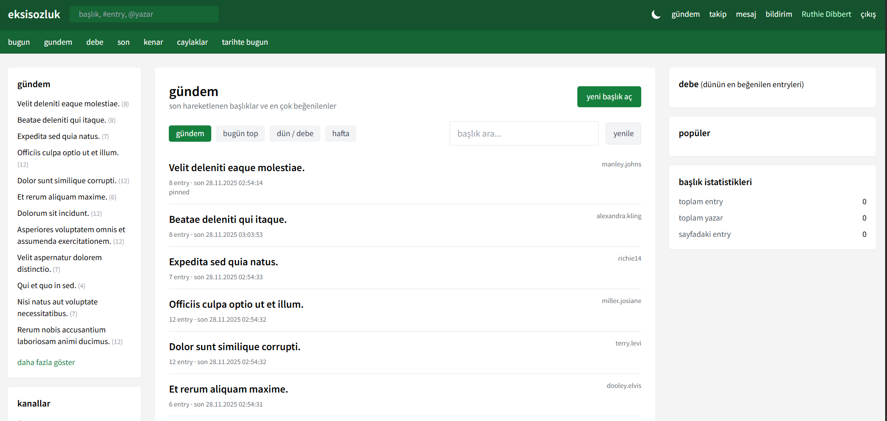

# Ekşi Sözlük Klonu (Laravel 10 + Vue 3 + Vite)

Bu proje, Ekşi Sözlük benzeri tam özellikli bir uygulamanın Laravel (API) ve Vue 3 (SPA) ile hazırlanmış klonudur. Kimlik doğrulama, başlık/entry akışı, oy/favori/takip, bildirim, mesajlaşma, raporlama ve moderasyon gibi ana işlevleri içerir.

## Özellikler
- Email/şifre ile kayıt/giriş (Sanctum token), kullanıcı profili ve istatistikleri.
- Başlık açma, entry yazma, düzenleme/silme, edit history görüntüleme.
- Oy (up/down), favori, takip, mention bildirimi; unread counter/polling.
- Takip feed’i, top/debe/bugün/hafta listeleri.
- Mesajlaşma (kullanıcı adı ile alıcı seçimi), bildirim ve raporlama akışı.
- Moderasyon: başlık lock/pin reason, entry sil/lock kontrolü, rapor çözümleme.
- Profil sayfası: son entry/başlık/favoriler ve sayaçlar.
- Temel arama (q), gündem/gündem-alt sekmeleri.

## Gereksinimler
- PHP 8.1+, Composer
- Node.js 18+, npm
- MySQL/MariaDB

## Kurulum
1) Bağımlılıkları yükle
```bash
composer install
npm install
```

2) `.env` düzenle, veritabanı bilgilerini gir.
```bash
cp .env.example .env
php artisan key:generate
```

3) Migrasyon ve seed
```bash
php artisan migrate:fresh --seed
```
Seeder ile admin/moderator kullanıcı: `admin@admin.com / 123456`

4) Geliştirme sunucuları
```bash
npm run dev
php artisan serve
```

## Ekran Görüntüleri

Ana sayfa, başlık detayı, profil ve mesajlaşma akışı için örnekler:

- Gündem/Top sekmeleri: `public/images/image.png`
- Başlık detayı ve entry etkileşimleri: `public/images/image copy.png`
- Profil ve istatistikler: `public/images/image copy 2.png`
- Mesajlaşma ve bildirimler: `public/images/image copy 3.png`
- Rapor/moderasyon görünümleri: `public/images/image copy 4.png`, `public/images/image copy 5.png`, `public/images/image copy 6.png`

README’yi GitHub’da görüntülerken bu yolları relative olarak kullanabilirsiniz:
```markdown



```
Proje içinde ihtiyaca göre farklı ekranlarla değiştirilebilir.

## Önemli API uçları (özet)
- Auth: `POST /api/auth/login`, `POST /api/auth/register`, `POST /api/auth/logout`
- Başlıklar: `GET /api/titles`, `GET /api/titles/{slug}`, `POST /api/titles` (auth), `PATCH /api/titles/{uuid}` (mod)
- Entry: `POST /api/entries/{slug}/store`, `PATCH /api/entries/{entry}`, `DELETE /api/entries/{entry}`, `GET /api/entries/{entry}/history`
- Oy/Favori/Takip: `POST /api/entries/{id}/vote`, `POST /api/entries/{id}/favorite`, `POST /api/users/{id}/follow`
- Feed: `GET /api/feed/following` (auth), `GET /api/feed/top?range=today|yesterday|week`
- Bildirim: `GET /api/notifications`, `GET /api/notifications/unread-count`, `POST /api/notifications/{id}/read`
- Mesaj: `GET /api/messages`, `POST /api/messages` (receiver_username veya receiver_id), `POST /api/messages/{id}/read`
- Rapor: `POST /api/reports`, `GET /api/reports` (mod), `POST /api/reports/{id}/resolve`
- Arama: `GET /api/search?q=...`

## Test
```bash
phpunit --filter FeedTopTest
```
Diğer feature testleri henüz eklenmedi; ihtiyaç halinde auth/feed/vote/follow vb. için genişletin.

## Notlar
- Moderasyon işlemleri için `is_moderator` alanı true olan kullanıcı gereklidir (Seeder’daki admin).
- Bildirimler polling ile çalışıyor; gerçek zamanlı yayın (broadcast) eklenmedi.
- UTF temizliği yapılmadı; TR karakter bozuklukları görülebilir, dil dosyaları/gösterimlerde düzeltilebilir.
